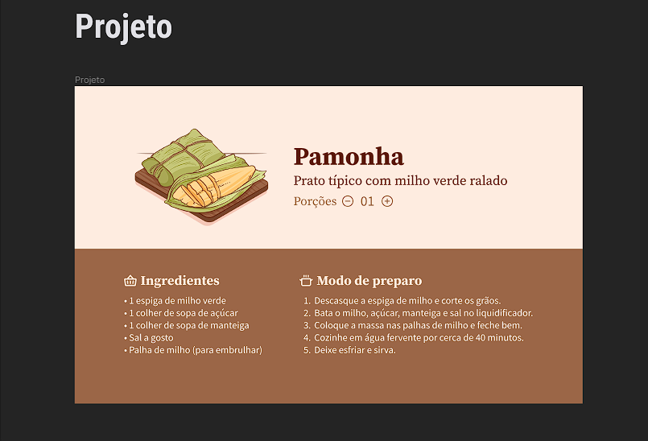

<h1 align="center"> Desafio 26 </h1>

26º desafio proposto pela Rocketseat, onde foi desenvolvida uma página web para receber pedidos de pamonhas.  

  <a href="#-tecnologias">Tecnologias</a>&nbsp;&nbsp;&nbsp;|&nbsp;&nbsp;&nbsp;
  <a href="#-projeto">Projeto</a>&nbsp;&nbsp;&nbsp;|&nbsp;&nbsp;&nbsp;
  <a href="#-layout">Layout</a>&nbsp;&nbsp;&nbsp;|&nbsp;&nbsp;&nbsp;
  <a href="#-aprendizado">Aprendizado</a>&nbsp;&nbsp;&nbsp;|&nbsp;&nbsp;&nbsp;
  <a href="#-licença">Licença</a>

  

 

  

## 🚀 Tecnologias

Esse projeto foi desenvolvido com as seguintes tecnologias:

- HTML e CSS
- JavaScript
- Git e Github
- Figma

---

## 💻 Projeto

É uma web page onde o usuário pode realizar pedidos de pamonhas.

[Acesse o projeto finalizado, online](https://Gustavo-Zamai.github.io/Desafio_26)

---

## 🔖 Layout

Você pode visualizar o layout do projeto através [Desse Link](https://www.figma.com/file/vQY0jZ231X8ds9s6eaa4ax/Receita-Junina-%E2%80%A2-Desafio-26-(Community)?type=design&node-id=3-376&mode=design). É necessário ter conta no [Figma](https://figma.com) para acessá-lo.

---

## 📑 Aprendizado

Utilizei o Javascript para realizar a contagem das porções pedidas, ao clicar no botão de adição ou no botão de subtração. 
O CSS foi utilizado para reforçar conceitos de estilização e display flex, utilizando o flex-direction, principalmente para estilizar as listas. 
O HTML foi semântico, utilizando as tags apropriadas para cada seção, parte do código. 

---

## 📝 Licença

Esse projeto está sob a licença MIT.

---

Feito com ♥ por Gustavo Zamai 😏😄
